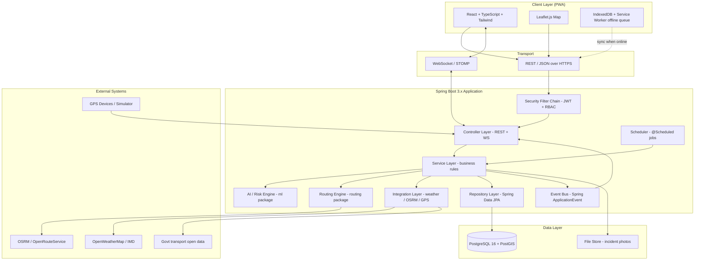
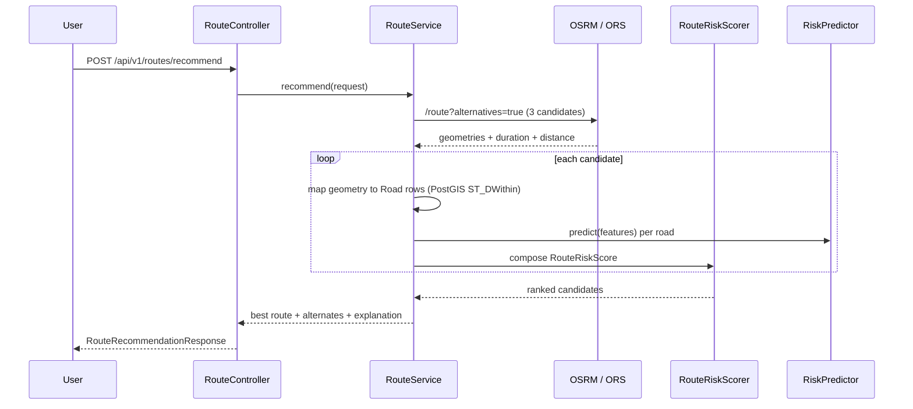

# NER-SmartLogix-AI — System Architecture (Phase 1)

> AI-Based Smart Logistics and Accessibility Intelligence Platform for the North Eastern Region (NER), India.
> Backend: **Java 21 / Spring Boot 3.x**. No Python anywhere in the stack.

---

## 1. Problem → Solution Mapping

| Real-world problem in NER | What the platform does | Module |
|---|---|---|
| Landslides/floods block roads without warning | Predict disruption risk per road segment | `ml` (Risk Engine) |
| Trucks get stuck on blocked routes | Risk-aware route recommendation | `routing` |
| Nobody knows where consignments are | GPS tracking + live map | `websocket`, `service` |
| Field damage is reported late (no network) | Offline-first PWA field reporting | frontend + `FieldReport` sync API |
| Districts get cut off silently | District accessibility status + alerts | `AccessibilityStatus`, `Alert` |
| Decision-makers have no single view | Analytics dashboard | `analytics` |

---

## 2. High-Level Architecture



### Why this shape

* **Layered / clean architecture** — Controller → Service (interface) → ServiceImpl → Repository. Controllers never touch repositories; services never return entities to the web layer (DTOs only).
* **Ports & adapters at the edges** — `ml` and `integration` expose Java *interfaces* (`RiskPredictor`, `WeatherProvider`, `RoutingProvider`). The rule-based engine and the mock weather client are just the first implementations; a Tribuo model or a real IMD client can be swapped in with zero controller/service changes. This is the SOLID "D" (dependency inversion) and it is the single most important design decision in the project.
* **Event-driven side effects** — when an incident is saved, the service publishes an `IncidentReportedEvent`. Listeners recalculate road risk, create alerts, and push WebSocket messages. This keeps `IncidentServiceImpl` small and makes each side effect independently testable.

---

## 3. Backend Package Structure & Responsibility

```
com.ner.smartlogix
├── config/          SecurityConfig, WebSocketConfig, JacksonConfig, OpenApiConfig,
│                    CorsConfig, AsyncConfig, SchedulingConfig, RestClientConfig
├── controller/      Thin HTTP layer. Validates input, delegates, returns ApiResponse<T>.
├── service/         Interfaces only (UserService, RoadService, RiskService, ...)
├── service/impl/    Business logic. @Transactional lives here.
├── repository/      Spring Data JPA + native PostGIS queries (@Query with ST_* functions)
├── entity/          JPA entities. Never leave the service layer.
├── dto/             request/  response/  — API contract objects with jakarta.validation
├── mapper/          Entity <-> DTO conversion (MapStruct)
├── security/        JwtTokenProvider, JwtAuthenticationFilter, CustomUserDetailsService,
│                    JwtAuthEntryPoint, @PreAuthorize expressions
├── exception/       GlobalExceptionHandler (@RestControllerAdvice), ResourceNotFoundException,
│                    BusinessRuleException, ErrorResponse
├── enums/           RoleName, RoadStatus, RiskLevel, IncidentType, Severity, DeliveryStatus,
│                    AlertType, AlertChannel, VehicleType, WeatherCondition
├── ml/              RiskPredictor (interface)
│   ├── rules/       RuleBasedRiskPredictor, RiskRule, RuleRegistry, ScoreCard
│   ├── feature/     RiskFeatureVector, FeatureExtractor   <- shared by rules AND future ML
│   └── model/       (Phase 8) TribuoRiskPredictor, ModelTrainingService
├── routing/         RoutingProvider (interface), OsrmRoutingClient, GraphRouteService,
│                    RouteRiskScorer, RouteCandidate, DijkstraRouteFinder (fallback)
├── websocket/       StompController, LocationBroadcaster, AlertBroadcaster, WsTopics
├── integration/     weather/ (WeatherProvider, OpenWeatherClient, MockWeatherClient),
│                    gps/ (GpsSimulator, GpsIngestService), govdata/ (TransportDataClient)
├── analytics/       DashboardService, aggregation projections
└── NerSmartLogixApplication.java
```

**Rule of thumb while learning:** if you cannot answer *"which of these folders does this class belong to?"* in one sentence, the class is doing too much — split it.

---

## 4. The AI / Risk Engine (Java, no Python)

### 4.1 Two-stage strategy

| Stage | When | Technology | Why |
|---|---|---|---|
| **Stage 1 — Rule engine + weighted scoring** | Phase 5 (now) | Plain Java, no extra dependency | Explainable, needs no training data, demo-able on day one, and NER domain knowledge (rainfall thresholds, slope, monsoon month) is genuinely predictive |
| **Stage 2 — Real Java ML** | Phase 8 (later) | **Tribuo** (Oracle, Apache-2.0) | Pure Java, small jar, provides `LogisticRegression` / `RandomForest` / XGBoost bindings, CSV loading and model provenance built in; trains on the synthetic history generated by then |

Deeplearning4j is deliberately **rejected**: ~1 GB of native ND4J binaries, painful Windows setup, and a neural network is the wrong tool for ~12 tabular features. Weka is a viable backup but is GPL-licensed and has an older API; Tribuo is the recommendation.

### 4.2 The contract that never changes

```java
public interface RiskPredictor {
    RiskPrediction predict(RiskFeatureVector features);
    String modelName();     // "rule-engine-v1" | "tribuo-rf-v2"
}
```

`RiskFeatureVector` is the seam. Both the rule engine and the future ML model consume the *same* feature object, so the `FeatureExtractor` written in Phase 5 is reused verbatim in Phase 8, and both predictors can run side by side for comparison.

### 4.3 Feature set (all obtainable from our own DB)

| Feature | Source | Type |
|---|---|---|
| `rainfall24h`, `rainfall72h` (mm) | `weather_data` | double |
| `weatherCondition` | `weather_data` | enum |
| `terrainSlopeDegrees` | `road.slope_degrees` | double |
| `roadCondition`, `roadStatus` | `road` | enum |
| `landslideSusceptibility` (0–1) | `road.landslide_susceptibility` | double |
| `floodProne` | `road.flood_prone` | boolean |
| `incidentCount30d`, `daysSinceLastIncident` | `incident` | int |
| `historicalBlockDaysPerYear` | `road` | double |
| `trafficCongestionLevel` | mock / `route_segment` | int 0–4 |
| `isMonsoonMonth` | system clock | boolean |
| `worstBridgeCondition` | `bridge` on that road | enum |

### 4.4 Scoring model (Stage 1)

Each rule returns a 0–100 sub-score; the engine combines them with weights read from `application.yml` (never hardcoded):

```
disruptionScore =
      0.30 * rainfallScore
    + 0.20 * landslideScore
    + 0.15 * floodScore
    + 0.15 * incidentHistoryScore
    + 0.10 * roadConditionScore
    + 0.10 * terrainScore

RiskLevel:  score < 35  -> LOW_RISK
            35 .. 65    -> MEDIUM_RISK
            > 65        -> HIGH_RISK
```

Every prediction returns a **`ScoreCard`** listing each rule that fired, its sub-score and its contribution — so the dashboard can say *"HIGH_RISK because 142 mm rain in 24 h + slope 27° + 3 landslides in the last 30 days"*. Explainability is a feature, not a nicety, for a government-facing system.

---

## 5. Route Optimization Design

### 5.1 Do not write Dijkstra first

OSRM / OpenRouteService already solve shortest-path on real OSM geometry far better than a hand-rolled graph. Our value-add is **risk-aware re-ranking**, not pathfinding.



### 5.2 Route score

```
routeScore = w1*travelTimeScore + w2*weatherRiskScore + w3*roadRiskScore
           + w4*incidentRiskScore + w5*disruptionProbabilityScore
```

Lower is better. Any candidate containing a `BLOCKED` road is **hard-filtered** (not merely penalised). Roads that are `HIGH_RISK` receive a heavy penalty but remain selectable when no alternative exists — with a warning flag, because "no route available" is useless to a relief convoy.

### 5.3 Fallback

`DijkstraRouteFinder` runs on our own `road` table graph (JGraphT) and is used when OSRM is unreachable, or when the user asks for a route restricted to *our* monitored network. Implemented in Phase 7, behind the same `RoutingProvider` interface.

---

## 6. Real-Time Architecture

```
STOMP endpoint:  /ws              (SockJS fallback enabled)
Broker prefix:   /topic , /queue
App prefix:      /app

/topic/vehicles                   -> all vehicle position updates (dashboard)
/topic/vehicles/{vehicleId}       -> single vehicle (tracking page)
/topic/alerts                     -> global alerts
/topic/alerts/district/{code}     -> district-scoped alerts
/topic/incidents                  -> newly reported incidents (live map pins)
/topic/roads/status               -> road status changes
/user/queue/notifications         -> per-user private notifications
```

JWT is validated in a `ChannelInterceptor` on the STOMP `CONNECT` frame — WebSocket messages do not carry an HTTP `Authorization` header, so authentication happens once at handshake and the `Principal` is bound to the session.

An in-memory `SimpleBroker` is used for the academic build; the config is written so switching to a RabbitMQ/ActiveMQ relay is a two-line change if you later demo horizontal scaling.

---

## 7. Data Flow Walk-throughs

### 7.1 Field officer reports a landslide (the flagship flow)

1. Officer (offline, in a valley) fills the incident form in the PWA → saved to **IndexedDB**, marked `PENDING_SYNC`.
2. Connectivity returns → Service Worker background sync POSTs `/api/v1/incidents` with a client-generated `clientUuid` (idempotency key, so a double sync cannot create duplicates).
3. `IncidentServiceImpl` persists the incident with a PostGIS `POINT(lon lat)`.
4. It publishes `IncidentReportedEvent`.
5. `RoadImpactListener` finds affected roads via `ST_DWithin(road.geom, :point, 500)`; if severity ≥ HIGH it sets `RoadStatus.BLOCKED` and writes an `AccessibilityStatus` row for the district.
6. `RiskRecalculationListener` re-runs `RiskPredictor` for those roads and stores the new `RiskLevel`.
7. `AlertService` creates an `Alert` (type `LANDSLIDE`, severity `CRITICAL`).
8. `AlertBroadcaster` pushes to `/topic/alerts` and `/topic/roads/status`.
9. Any in-transit `Delivery` whose route uses that road is flagged `DELAYED`; `RouteService` computes an alternate and the driver receives a private notification.
10. Dashboard counters and the Leaflet map update live — no page refresh.

### 7.2 GPS position update

Device / simulator → `POST /api/v1/vehicles/{id}/locations` (or STOMP `/app/gps`) → validated → `vehicle_location` insert + `vehicle.last_*` update → geofence check against `HIGH_RISK` zones (`ST_Contains`) → optional alert → broadcast to `/topic/vehicles/{id}`.

### 7.3 Scheduled weather sweep

`@Scheduled(cron)` every 30 minutes → `WeatherProvider.fetch(district)` for all districts → persist `weather_data` → recompute risk for roads in that district → status/alert changes broadcast. This is what makes the platform feel alive during a demo without any manual clicking.

---

## 8. Security Architecture

* **Stateless JWT.** Access token 15 min; refresh token 7 days stored **hashed** in a `refresh_token` table so it can be revoked on logout.
* **BCrypt** (strength 10) for passwords. Secret and expiry come from environment variables — `JWT_SECRET` has **no default** in `application.yml`, so the app fails fast when it is missing. That is intentional.
* **Authorization** = role-based via `@PreAuthorize("hasRole('ADMIN')")` plus ownership checks (a `DRIVER` may read only their own deliveries — enforced in the service, not the controller).
* Method security enabled with `@EnableMethodSecurity`.
* CORS restricted to the configured frontend origin.
* All write endpoints validated with `jakarta.validation`; `GlobalExceptionHandler` converts violations into a stable error envelope.
* Photo uploads: content-type + magic-byte check, size cap, stored outside the web root under a generated filename.

### Role → capability matrix

| Capability | ADMIN | AUTHORITY_OFFICIAL | LOGISTICS_MANAGER | FIELD_OFFICER | DRIVER |
|---|:--:|:--:|:--:|:--:|:--:|
| Manage users & roles | Y | - | - | - | - |
| CRUD districts / roads / bridges | Y | Y | - | - | - |
| Change road status | Y | Y | - | via incident | - |
| CRUD vehicles & drivers | Y | - | Y | - | - |
| Create / assign deliveries | Y | - | Y | - | - |
| Update delivery status | Y | - | Y | - | own only |
| Push GPS location | Y | - | - | - | own vehicle |
| Report incident | Y | Y | Y | Y | Y |
| Verify / close incident | Y | Y | - | - | - |
| Request route recommendation | Y | Y | Y | Y | Y |
| View analytics dashboard | Y | Y | Y | - | - |
| Broadcast manual alert | Y | Y | - | - | - |

---

## 9. Dependency Justification (nothing added without a reason)

| Dependency | Why it earns its place |
|---|---|
| `spring-boot-starter-web` | REST layer |
| `spring-boot-starter-data-jpa` | ORM + repositories |
| `spring-boot-starter-security` | Auth filter chain, BCrypt |
| `spring-boot-starter-validation` | `@Valid` request validation |
| `spring-boot-starter-websocket` | STOMP real-time |
| `jjwt-api / impl / jackson` (0.12.x) | JWT create/parse; modern, actively maintained API |
| `postgresql` driver | DB access |
| **`hibernate-spatial`** | Maps PostGIS `geometry` columns to JTS `Point` / `LineString` / `Polygon` Java types. Without it you would store WKT strings and lose all spatial querying |
| **`jts-core`** | The geometry classes themselves (transitive; listed for clarity) |
| **`flyway-core`** | Versioned SQL migrations. `ddl-auto=update` cannot enable the PostGIS extension or create GiST indexes — Flyway can, and it is what real teams use |
| **`mapstruct`** | Compile-time Entity↔DTO mappers; generates plain Java, no runtime reflection, removes hundreds of lines of boilerplate |
| `lombok` | Removes getter/setter/builder noise |
| `springdoc-openapi-starter-webmvc-ui` | Auto-generated Swagger UI at `/swagger-ui.html` — excellent for the viva/demo |
| **`tribuo-classification-*`** (Phase 8 only) | Pure-Java ML, Apache-2.0, tabular-friendly |
| **`jgrapht-core`** (Phase 7 only) | Battle-tested Dijkstra / A* so we do not hand-roll graph algorithms |
| `spring-boot-starter-actuator` | `/actuator/health` for Docker healthchecks |
| `testcontainers` + `postgis` module (test scope) | Integration tests against real PostGIS (H2 has no PostGIS support) |

Explicitly **not** used: Kafka (overkill for one node), Redis (no cache pressure yet), Elasticsearch, Deeplearning4j, and any Python bridge.

---

## 10. Environment / Configuration Strategy

All secrets come from environment variables, resolved in `application.yml` as `${VAR}` with **no fallback for secrets**:

```
DB_URL, DB_USERNAME, DB_PASSWORD
JWT_SECRET, JWT_ACCESS_EXPIRATION_MS, JWT_REFRESH_EXPIRATION_MS
WEATHER_API_KEY, WEATHER_API_BASE_URL, WEATHER_PROVIDER=mock|openweather
OSRM_BASE_URL, ORS_API_KEY, ROUTING_PROVIDER=osrm|ors|internal
FILE_STORAGE_PATH
FRONTEND_ORIGIN
GPS_SIMULATOR_ENABLED=true
```

Profiles: `dev` (mock weather, GPS simulator on, seed data), `docker`, `prod` (real providers, simulator off, stricter logging).

---

## 11. Deployment (docker-compose)

```
services:
  postgis    -> postgis/postgis:16-3.4        (named volume: pgdata)
  backend    -> build ./backend, depends_on postgis healthy, port 8080
  frontend   -> build ./frontend (nginx serving the Vite build), port 5173
  osrm       -> osrm/osrm-backend  (optional profile "full": needs an NE-India .osm.pbf extract)
```

The `osrm` service is optional and heavy (region extract + preprocessing). The default dev setup uses the public OSRM demo server or the mock routing provider.

---

## 12. Non-Functional Targets (realistic for an academic build)

| Concern | Target | How |
|---|---|---|
| API latency | < 300 ms p95 for reads | Indexed queries, DTO projections, no N+1 (`@EntityGraph`) |
| Live updates | < 2 s from incident to map pin | Event listener + STOMP broadcast |
| Concurrent vehicles | 200 simulated | Batched location writes, async broadcast executor |
| Data volume | ~1 M location rows | Index on `(vehicle_id, recorded_at desc)`, retention job |
| External API outage | degrade gracefully | Every integration has a mock fallback, timeout, and try/catch isolation |
| Auditability | who changed what | `BaseAuditEntity` with created/updated by + at on every table |
