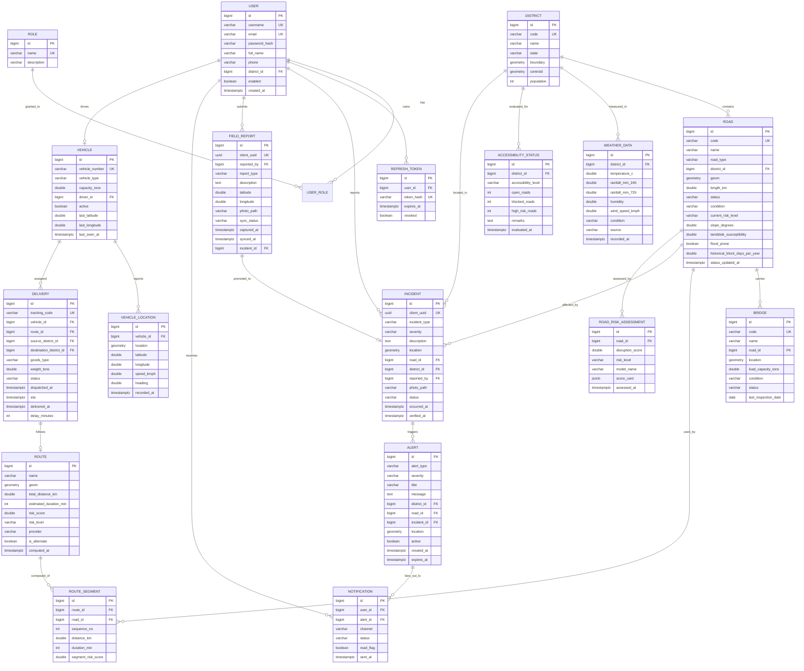

# NER-SmartLogix-AI — Database Design (Phase 1)

**Engine:** PostgreSQL 16 + PostGIS 3.4
**Migrations:** Flyway (`backend/src/main/resources/db/migration/V1__init.sql`, `V2__seed.sql`, ...)
**SRID:** 4326 (WGS-84 lat/lon) for storage. Distance queries use `geography` casts so results are in metres.

---

## 1. ER Diagram



---

## 2. Enumerations (stored as `VARCHAR` + `CHECK`, mapped with `@Enumerated(EnumType.STRING)`)

| Enum | Values |
|---|---|
| `RoleName` | ADMIN, AUTHORITY_OFFICIAL, FIELD_OFFICER, LOGISTICS_MANAGER, DRIVER |
| `RoadStatus` | OPEN, PARTIALLY_ACCESSIBLE, HIGH_RISK, BLOCKED |
| `RoadCondition` | GOOD, FAIR, POOR, DAMAGED |
| `RoadType` | NATIONAL_HIGHWAY, STATE_HIGHWAY, DISTRICT_ROAD, RURAL_ROAD, MOUNTAIN_PASS |
| `RiskLevel` | LOW_RISK, MEDIUM_RISK, HIGH_RISK |
| `IncidentType` | LANDSLIDE, FLOOD, ROAD_DAMAGE, BRIDGE_DAMAGE, TRAFFIC_CONGESTION, ACCIDENT, OTHER |
| `Severity` | LOW, MEDIUM, HIGH, CRITICAL |
| `IncidentStatus` | REPORTED, VERIFIED, IN_PROGRESS, RESOLVED, REJECTED |
| `DeliveryStatus` | CREATED, IN_TRANSIT, DELAYED, DELIVERED |
| `VehicleType` | TRUCK, MINI_TRUCK, TANKER, AMBULANCE, RELIEF_VAN |
| `WeatherCondition` | CLEAR, CLOUDY, LIGHT_RAIN, HEAVY_RAIN, THUNDERSTORM, FOG, SNOW |
| `AccessibilityLevel` | FULLY_ACCESSIBLE, PARTIALLY_ACCESSIBLE, RESTRICTED, CUT_OFF |
| `AlertType` | ROAD_BLOCKED, HEAVY_RAINFALL, LANDSLIDE_RISK, FLOOD_RISK, DELIVERY_DELAYED, HIGH_RISK_ROUTE, DANGER_ZONE_ENTRY, DISTRICT_INACCESSIBLE |
| `AlertChannel` | WEBSOCKET, EMAIL, SMS, PUSH |
| `BridgeStatus` | OPEN, WEIGHT_RESTRICTED, CLOSED |
| `SyncStatus` | PENDING, SYNCED, FAILED |

Why `VARCHAR` and not a PostgreSQL `ENUM` type: adding a value to a PG enum requires a migration and locks; a `VARCHAR` + `CHECK` constraint is simpler to evolve and reads cleanly in `psql`. Why not `ORDINAL`: inserting a new enum constant in the middle would silently corrupt every existing row.

---

## 3. Table Details, Constraints & Indexes

### 3.1 Identity & access

```sql
CREATE TABLE users (
    id            BIGSERIAL PRIMARY KEY,
    username      VARCHAR(50)  NOT NULL UNIQUE,
    email         VARCHAR(120) NOT NULL UNIQUE,
    password_hash VARCHAR(100) NOT NULL,
    full_name     VARCHAR(120) NOT NULL,
    phone         VARCHAR(15),
    district_id   BIGINT REFERENCES district(id),
    enabled       BOOLEAN NOT NULL DEFAULT TRUE,
    created_at    TIMESTAMPTZ NOT NULL DEFAULT now(),
    updated_at    TIMESTAMPTZ,
    created_by    VARCHAR(50),
    updated_by    VARCHAR(50)
);

CREATE TABLE role (
    id          BIGSERIAL PRIMARY KEY,
    name        VARCHAR(30) NOT NULL UNIQUE
                CHECK (name IN ('ADMIN','AUTHORITY_OFFICIAL','FIELD_OFFICER',
                                'LOGISTICS_MANAGER','DRIVER')),
    description VARCHAR(200)
);

CREATE TABLE user_role (
    user_id BIGINT NOT NULL REFERENCES users(id) ON DELETE CASCADE,
    role_id BIGINT NOT NULL REFERENCES role(id),
    PRIMARY KEY (user_id, role_id)
);

CREATE TABLE refresh_token (
    id         BIGSERIAL PRIMARY KEY,
    user_id    BIGINT NOT NULL REFERENCES users(id) ON DELETE CASCADE,
    token_hash VARCHAR(128) NOT NULL UNIQUE,
    expires_at TIMESTAMPTZ NOT NULL,
    revoked    BOOLEAN NOT NULL DEFAULT FALSE
);
CREATE INDEX idx_refresh_user ON refresh_token(user_id) WHERE revoked = FALSE;
```

`users` is plural because `user` is a reserved word in PostgreSQL. A separate `role` table (rather than a plain enum column) is what the requirement asks for and lets an admin grant multiple roles to one person — common in the field, where an officer is also a manager.

### 3.2 Geography

```sql
CREATE EXTENSION IF NOT EXISTS postgis;

CREATE TABLE district (
    id         BIGSERIAL PRIMARY KEY,
    code       VARCHAR(20) NOT NULL UNIQUE,          -- e.g. 'AS-KAM', 'ML-EKH'
    name       VARCHAR(100) NOT NULL,
    state      VARCHAR(60)  NOT NULL,                -- Assam, Meghalaya, ...
    boundary   geometry(MultiPolygon, 4326),
    centroid   geometry(Point, 4326),
    population INTEGER,
    area_sq_km DOUBLE PRECISION
);
CREATE INDEX idx_district_boundary ON district USING GIST (boundary);

CREATE TABLE road (
    id            BIGSERIAL PRIMARY KEY,
    code          VARCHAR(30) NOT NULL UNIQUE,
    name          VARCHAR(150) NOT NULL,
    road_type     VARCHAR(30) NOT NULL,
    district_id   BIGINT NOT NULL REFERENCES district(id),
    geom          geometry(LineString, 4326) NOT NULL,
    length_km     DOUBLE PRECISION NOT NULL CHECK (length_km > 0),
    status        VARCHAR(25) NOT NULL DEFAULT 'OPEN',
    condition     VARCHAR(20) NOT NULL DEFAULT 'GOOD',
    current_risk_level VARCHAR(20) NOT NULL DEFAULT 'LOW_RISK',
    slope_degrees DOUBLE PRECISION DEFAULT 0,
    landslide_susceptibility DOUBLE PRECISION DEFAULT 0
                  CHECK (landslide_susceptibility BETWEEN 0 AND 1),
    flood_prone   BOOLEAN NOT NULL DEFAULT FALSE,
    historical_block_days_per_year DOUBLE PRECISION DEFAULT 0,
    status_updated_at TIMESTAMPTZ,
    created_at    TIMESTAMPTZ NOT NULL DEFAULT now(),
    updated_at    TIMESTAMPTZ
);
CREATE INDEX idx_road_geom    ON road USING GIST (geom);
CREATE INDEX idx_road_status  ON road(status);
CREATE INDEX idx_road_risk    ON road(current_risk_level);
CREATE INDEX idx_road_district ON road(district_id);
```

`road.geom` is a `LineString` so that PostGIS can answer *"which roads are within 500 m of this landslide?"* (`ST_DWithin`) and *"how much of this OSRM route overlaps our monitored roads?"* (`ST_Intersects`). `current_risk_level` is a denormalised cache of the newest `road_risk_assessment` — the dashboard reads it thousands of times and must not join a history table each time.

```sql
CREATE TABLE bridge (
    id                  BIGSERIAL PRIMARY KEY,
    code                VARCHAR(30) NOT NULL UNIQUE,
    name                VARCHAR(150) NOT NULL,
    road_id             BIGINT NOT NULL REFERENCES road(id),
    location            geometry(Point, 4326) NOT NULL,
    load_capacity_tons  DOUBLE PRECISION,
    condition           VARCHAR(20) NOT NULL DEFAULT 'GOOD',
    status              VARCHAR(25) NOT NULL DEFAULT 'OPEN',
    last_inspection_date DATE
);
CREATE INDEX idx_bridge_location ON bridge USING GIST (location);
```

### 3.3 Fleet & delivery

```sql
CREATE TABLE vehicle (
    id             BIGSERIAL PRIMARY KEY,
    vehicle_number VARCHAR(20) NOT NULL UNIQUE,      -- 'AS01AB1234'
    vehicle_type   VARCHAR(20) NOT NULL,
    capacity_tons  DOUBLE PRECISION,
    driver_id      BIGINT UNIQUE REFERENCES users(id),
    active         BOOLEAN NOT NULL DEFAULT TRUE,
    last_latitude  DOUBLE PRECISION,
    last_longitude DOUBLE PRECISION,
    last_seen_at   TIMESTAMPTZ
);

CREATE TABLE vehicle_location (
    id          BIGSERIAL PRIMARY KEY,
    vehicle_id  BIGINT NOT NULL REFERENCES vehicle(id) ON DELETE CASCADE,
    location    geometry(Point, 4326) NOT NULL,
    latitude    DOUBLE PRECISION NOT NULL CHECK (latitude BETWEEN -90 AND 90),
    longitude   DOUBLE PRECISION NOT NULL CHECK (longitude BETWEEN -180 AND 180),
    speed_kmph  DOUBLE PRECISION,
    heading     DOUBLE PRECISION,
    recorded_at TIMESTAMPTZ NOT NULL DEFAULT now()
);
CREATE INDEX idx_vloc_vehicle_time ON vehicle_location(vehicle_id, recorded_at DESC);
CREATE INDEX idx_vloc_geom         ON vehicle_location USING GIST (location);
```

`vehicle_location` is the only high-volume table (one row per vehicle per ~10 s). The composite descending index makes "latest position" and "trail for the last hour" both cheap. `vehicle.last_*` columns duplicate the newest row on purpose so the map's initial load is a single `SELECT` with no correlated subquery. A retention job deletes rows older than 30 days.

```sql
CREATE TABLE delivery (
    id                      BIGSERIAL PRIMARY KEY,
    tracking_code           VARCHAR(24) NOT NULL UNIQUE,
    vehicle_id              BIGINT REFERENCES vehicle(id),
    route_id                BIGINT REFERENCES route(id),
    source_district_id      BIGINT NOT NULL REFERENCES district(id),
    destination_district_id BIGINT NOT NULL REFERENCES district(id),
    source_label            VARCHAR(150),
    destination_label       VARCHAR(150),
    goods_type              VARCHAR(60) NOT NULL,      -- MEDICINE, FOOD, AGRI_PRODUCE, ...
    weight_tons             DOUBLE PRECISION,
    status                  VARCHAR(20) NOT NULL DEFAULT 'CREATED',
    dispatched_at           TIMESTAMPTZ,
    eta                     TIMESTAMPTZ,
    delivered_at            TIMESTAMPTZ,
    delay_minutes           INTEGER NOT NULL DEFAULT 0,
    created_by              BIGINT REFERENCES users(id),
    created_at              TIMESTAMPTZ NOT NULL DEFAULT now(),
    CHECK (source_district_id <> destination_district_id)
);
CREATE INDEX idx_delivery_status  ON delivery(status);
CREATE INDEX idx_delivery_vehicle ON delivery(vehicle_id);
```

### 3.4 Routing

```sql
CREATE TABLE route (
    id                     BIGSERIAL PRIMARY KEY,
    name                   VARCHAR(150),
    geom                   geometry(LineString, 4326),
    total_distance_km      DOUBLE PRECISION NOT NULL,
    estimated_duration_min INTEGER NOT NULL,
    risk_score             DOUBLE PRECISION NOT NULL DEFAULT 0,
    risk_level             VARCHAR(20) NOT NULL DEFAULT 'LOW_RISK',
    provider               VARCHAR(20) NOT NULL DEFAULT 'OSRM',
    is_alternate           BOOLEAN NOT NULL DEFAULT FALSE,
    parent_route_id        BIGINT REFERENCES route(id),
    computed_at            TIMESTAMPTZ NOT NULL DEFAULT now()
);
CREATE INDEX idx_route_geom ON route USING GIST (geom);

CREATE TABLE route_segment (
    id                 BIGSERIAL PRIMARY KEY,
    route_id           BIGINT NOT NULL REFERENCES route(id) ON DELETE CASCADE,
    road_id            BIGINT REFERENCES road(id),
    sequence_no        INTEGER NOT NULL,
    distance_km        DOUBLE PRECISION NOT NULL,
    duration_min       INTEGER NOT NULL,
    segment_risk_score DOUBLE PRECISION DEFAULT 0,
    UNIQUE (route_id, sequence_no)
);
```

`route_segment` is the bridge between an externally computed OSRM polyline and *our* monitored road network: each segment optionally points at a `road` row, which is what lets us say "this route passes 3 HIGH_RISK roads".

### 3.5 Events, risk and alerting

```sql
CREATE TABLE incident (
    id            BIGSERIAL PRIMARY KEY,
    client_uuid   UUID UNIQUE,                       -- offline idempotency key
    incident_type VARCHAR(30) NOT NULL,
    severity      VARCHAR(15) NOT NULL,
    description   TEXT,
    location      geometry(Point, 4326) NOT NULL,
    latitude      DOUBLE PRECISION NOT NULL,
    longitude     DOUBLE PRECISION NOT NULL,
    road_id       BIGINT REFERENCES road(id),
    district_id   BIGINT REFERENCES district(id),
    reported_by   BIGINT NOT NULL REFERENCES users(id),
    photo_path    VARCHAR(255),
    status        VARCHAR(20) NOT NULL DEFAULT 'REPORTED',
    occurred_at   TIMESTAMPTZ NOT NULL,
    created_at    TIMESTAMPTZ NOT NULL DEFAULT now(),
    verified_at   TIMESTAMPTZ,
    verified_by   BIGINT REFERENCES users(id)
);
CREATE INDEX idx_incident_location ON incident USING GIST (location);
CREATE INDEX idx_incident_road_time ON incident(road_id, occurred_at DESC);
CREATE INDEX idx_incident_status ON incident(status);

CREATE TABLE weather_data (
    id              BIGSERIAL PRIMARY KEY,
    district_id     BIGINT NOT NULL REFERENCES district(id),
    temperature_c   DOUBLE PRECISION,
    rainfall_mm_24h DOUBLE PRECISION NOT NULL DEFAULT 0,
    rainfall_mm_72h DOUBLE PRECISION NOT NULL DEFAULT 0,
    humidity        DOUBLE PRECISION,
    wind_speed_kmph DOUBLE PRECISION,
    condition       VARCHAR(20) NOT NULL,
    source          VARCHAR(30) NOT NULL DEFAULT 'MOCK',
    recorded_at     TIMESTAMPTZ NOT NULL DEFAULT now()
);
CREATE INDEX idx_weather_district_time ON weather_data(district_id, recorded_at DESC);

CREATE TABLE road_risk_assessment (
    id               BIGSERIAL PRIMARY KEY,
    road_id          BIGINT NOT NULL REFERENCES road(id) ON DELETE CASCADE,
    disruption_score DOUBLE PRECISION NOT NULL,
    risk_level       VARCHAR(20) NOT NULL,
    model_name       VARCHAR(40) NOT NULL,
    score_card       JSONB,                 -- per-rule contributions, for explainability
    assessed_at      TIMESTAMPTZ NOT NULL DEFAULT now()
);
CREATE INDEX idx_rra_road_time ON road_risk_assessment(road_id, assessed_at DESC);

CREATE TABLE accessibility_status (
    id                  BIGSERIAL PRIMARY KEY,
    district_id         BIGINT NOT NULL REFERENCES district(id),
    accessibility_level VARCHAR(25) NOT NULL,
    open_roads          INTEGER NOT NULL DEFAULT 0,
    blocked_roads       INTEGER NOT NULL DEFAULT 0,
    high_risk_roads     INTEGER NOT NULL DEFAULT 0,
    remarks             TEXT,
    evaluated_at        TIMESTAMPTZ NOT NULL DEFAULT now()
);
CREATE INDEX idx_access_district_time ON accessibility_status(district_id, evaluated_at DESC);

CREATE TABLE alert (
    id          BIGSERIAL PRIMARY KEY,
    alert_type  VARCHAR(30) NOT NULL,
    severity    VARCHAR(15) NOT NULL,
    title       VARCHAR(150) NOT NULL,
    message     TEXT NOT NULL,
    district_id BIGINT REFERENCES district(id),
    road_id     BIGINT REFERENCES road(id),
    incident_id BIGINT REFERENCES incident(id),
    delivery_id BIGINT REFERENCES delivery(id),
    location    geometry(Point, 4326),
    active      BOOLEAN NOT NULL DEFAULT TRUE,
    created_at  TIMESTAMPTZ NOT NULL DEFAULT now(),
    expires_at  TIMESTAMPTZ
);
CREATE INDEX idx_alert_active_time ON alert(active, created_at DESC);

CREATE TABLE notification (
    id        BIGSERIAL PRIMARY KEY,
    user_id   BIGINT NOT NULL REFERENCES users(id) ON DELETE CASCADE,
    alert_id  BIGINT REFERENCES alert(id) ON DELETE CASCADE,
    channel   VARCHAR(15) NOT NULL DEFAULT 'WEBSOCKET',
    status    VARCHAR(15) NOT NULL DEFAULT 'SENT',
    read_flag BOOLEAN NOT NULL DEFAULT FALSE,
    sent_at   TIMESTAMPTZ NOT NULL DEFAULT now()
);
CREATE INDEX idx_notif_user_unread ON notification(user_id) WHERE read_flag = FALSE;

CREATE TABLE field_report (
    id          BIGSERIAL PRIMARY KEY,
    client_uuid UUID NOT NULL UNIQUE,
    reported_by BIGINT NOT NULL REFERENCES users(id),
    report_type VARCHAR(30) NOT NULL,
    description TEXT,
    latitude    DOUBLE PRECISION NOT NULL,
    longitude   DOUBLE PRECISION NOT NULL,
    photo_path  VARCHAR(255),
    sync_status VARCHAR(15) NOT NULL DEFAULT 'SYNCED',
    captured_at TIMESTAMPTZ NOT NULL,     -- when the officer filled the form (offline)
    synced_at   TIMESTAMPTZ,              -- when the server received it
    incident_id BIGINT REFERENCES incident(id)
);
```

`captured_at` vs `synced_at` is the whole point of the offline module: a report captured at 09:14 in a valley and synced at 14:40 must still appear on the timeline at 09:14.

---

## 4. Key Spatial Queries the Schema Must Support

| Question | Query sketch |
|---|---|
| Roads within 500 m of an incident | `ST_DWithin(road.geom::geography, :point::geography, 500)` |
| Which district contains this GPS point? | `ST_Contains(district.boundary, :point)` |
| Is a vehicle inside a danger zone? | `ST_Contains(zone.geom, vehicle_location.location)` |
| Which monitored roads does an OSRM route touch? | `ST_Intersects(route.geom, road.geom)` |
| Length of a road in km | `ST_Length(geom::geography) / 1000` |
| Nearest 5 incidents to a vehicle | `ORDER BY road.geom <-> :point LIMIT 5` (GiST KNN) |

---

## 5. Seed Data Plan (`V2__seed.sql` + `DataSeeder` for the dev profile)

* **8 states / ~25 districts** of the NER with realistic centroids and simplified boundary polygons (Kamrup, East Khasi Hills, Dimapur, Imphal West, Papum Pare, West Tripura, Aizawl, East Sikkim, ...).
* **~60 roads** including real corridors that matter: NH-27, NH-6 (Shillong–Silchar), NH-2, NH-306, NH-10 (Sikkim), NH-37; with plausible `slope_degrees` and `landslide_susceptibility` for hill segments.
* **~15 bridges**, a few weight-restricted.
* **5 users**, one per role, password from an env var, never committed.
* **10 vehicles** with drivers, **20 deliveries** in mixed states.
* **~40 historical incidents** spread over 12 months, monsoon-weighted (June–September) — this doubles as the Phase 8 ML training set.
* **90 days of synthetic weather** per district with a monsoon rainfall curve.

All seed data is clearly labelled mock/sample; real GSI landslide zonation and IMD feeds can replace it later without schema changes.

---

## 6. Migration Order

```
V1__enable_postgis.sql
V2__core_identity.sql         users, role, user_role, refresh_token
V3__geography.sql             district, road, bridge
V4__fleet.sql                 vehicle, vehicle_location, delivery
V5__routing.sql               route, route_segment
V6__events_risk.sql           incident, weather_data, road_risk_assessment,
                              accessibility_status, alert, notification, field_report
V7__indexes.sql               all GiST + composite indexes
V8__seed_reference.sql        districts, roads, bridges, roles
V9__seed_demo.sql             dev-profile demo users, vehicles, deliveries, incidents
```

Hibernate runs with `ddl-auto: validate` — Flyway owns the schema, Hibernate only checks that the entities match it. This catches entity/schema drift at startup instead of at runtime.
